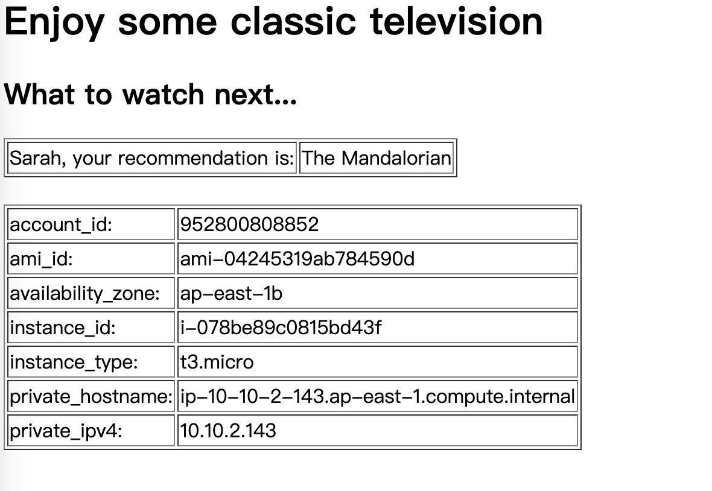
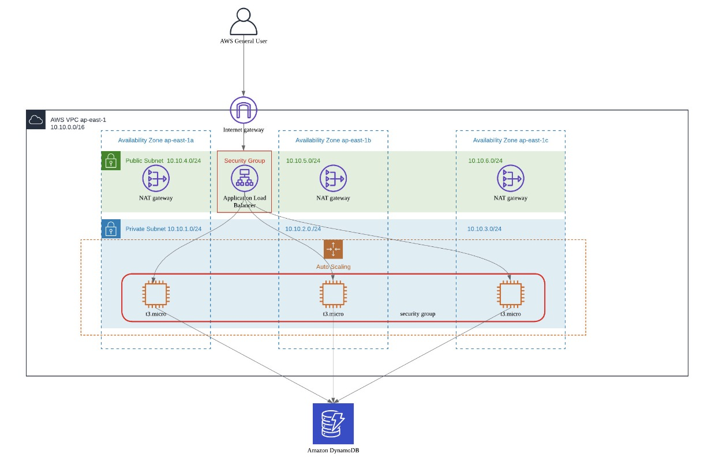
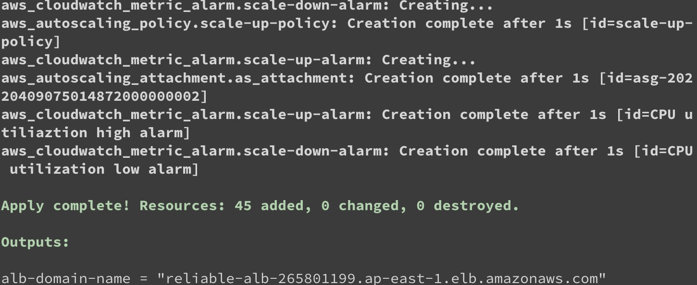
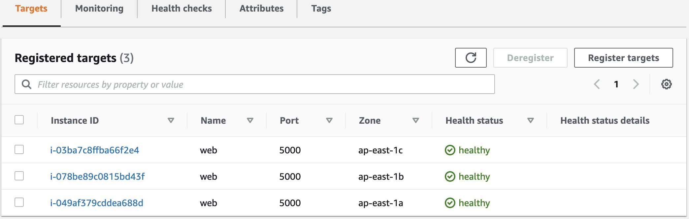

# AWS Reliable Multitier Infrastructure deployment with Terraform

## Introduction
This is a lab for deploying a reliable multitier aws infrastructure with Terraform. If you don't know what it is Terraform, you can refer to <https://registry.terraform.io/>. In short, Terraform is an IaC (Infrastructure as Code) tool to help developers to build and create infrastructure on public cloud or on premises automatically. In this lab, I refer to [AWS Well-Architected Labs](https://wellarchitectedlabs.com/) but accomplish the lab with different tool and code,such as Terraform to build aws infrastructure, Python framework Flask to create a very simple web application, you can find the same architecture and app function in [Level100 Labs](https://wellarchitectedlabs.com/reliability/100_labs/100_deploy_cloudformation/) in  Reliability section in [AWS Well-Architected Labs](https://wellarchitectedlabs.com/). 

## Target
The lab mainly focus on how to use Terraform to build and create infrastructure on AWS, and in turn you can understand how the aws components work. At the end of the lab, you will get a two tiers of infrastructure and a scalable web server configuration. Once you have done the development, you will see below page on your web browser:

The simple web application simulate a recommendation service, actually it is just a random number for customer ID to retrieve a recommend TV show and meanwhile retrieve the metadata for the current ec2 instance in visiting.

## How-to Deploy Infrastructure
The first thing we need to confirm is the architect so that I can know what resources and dependencies need to be created, the system diagram came from AWS Well-Architected Labs but I draw myself in Lucidchart which is a useful online drawing tool:

According to the diagram, we figure out that below resources need to be created:
- a VPC in region ap-east-1, which include the public and private subnets, security groups, internet gateway, route tables. I put all these resources in a single vpc.tf Terraform file
- autoscaling group and policy, the autoscaling group will attach to application load balancer target group
- three NAT Gateways in public subnets for our web instances to download application code and update software from internet
- an application load balancer for handling internet traffic and distribut to backend web server group, I use port 5000 as traffic and health check, because it just a lab not a production enviornment
- security groups for web servers in private subnet and application load balancer in public subnet
- internet gateway for internet traffic
- Dynamodb for storing customer information
- iam role for ec2 instance to access dynamodb to get items
- a jump server for troubleshooting if you encounter error when loading the page, for example, to check if the ec2 instance run the user data during the creation or if required tcp port openned in security group, etc.

Except the above resources, Terraform require a provider where you can set which cloud provider used and the corresponding version. We also need a variable file which makes our code resusable, so that you don't need to modify your resource creation code on next time building.
The basic syntax of creating a resource in Terraform is as below:  
        
        resource "keyword" "name" {
            argument1 = something
            argument2 = something
            argument3 = something
        } 
The key word is the resource name in Terraform, like aws_instance, aws_dynamodb_table, aws_autoscaling_group, it's easy to understand what resource will be created according to the name. You can find all the necessary information in Terraform documentation, in this lab, we use AWS as the provider, you can refer to <https://registry.terraform.io/providers/hashicorp/aws/latest/docs>.  
The argument is the attribute you configure a resource, for example, you need to set the load balancer type or subnets as basic information to create an applicaiton load balancer, but in Terraform there is a good point that it already set the default value for you, like application load balancer is the default one so you don't even need to assign the value in your code. For better understanding, usually you can define some necessary values explicitly. 

At last, you need to prepare your application code, the key point is to let your application communicate with dynamodb. Fortunately, aws provide a python framework boto3 for us to interact with dynamodb api, you just need to write simple codes to accomplish it.  
        
        def get_recomm(user_id):
            dynamodb = boto3.client('dynamodb', region_name="ap-east-1")
                key = {
                "UserID": {"N": user_id}
            }
            response = dynamodb.get_item(TableName="recomm_service", Key=key)
            return response['Item']['CustomerName']['S'], response['Item']['RecommTV']['S']

When you prepare all resource files, variable file, provider and applicaiton code, you need to allow Terraform to use credential to access aws. In my way, I installed aws cli tool and set the credential in .aws/configure in my laptop. Then, you just need three simple steps (init --> plan --> apply) in 10mins to bring up the infrastructure.  
Once done, you will see below information:  
  

We check the aws platform, we will see all the instances are in health status:  
  

Now, you can use the domain name of ALB plus port 5000 to verify the result as show in the beginning of the lab.

At last, remember to destroy all the resources using `terraform destroy`.
   
